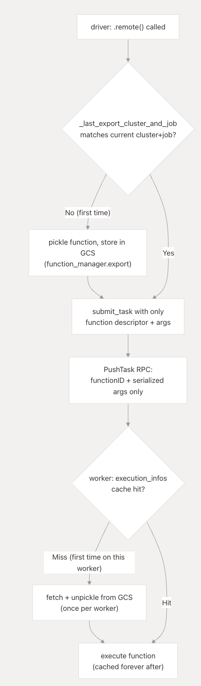

# Why Ray Uses `_last_export_cluster_and_job` for Deduplication

Exporting a Python function or actor definition across a distributed cluster requires serializing the bytecode, pushing it through the centralized `GCS` (Global Control Store), and unpacking it on workers. This creates a severe bandwidth and storage bottleneck if executed indiscriminately per invocation.

**Core Invariant:** A function's definition (its bytecode) must be securely transmitted and cached on exactly one job per cluster runtime environment. Echoing task serialization optimization strategies seen in [Spark (NSDI '12)](../References/nsdi12-final138.pdf) regarding closure shipping and properly formalized within the [Ray architecture paper (OSDI '18)](../References/osdi18-moritz.pdf), blind re-exporting saturates the underlying control stores, permanently throttling distributed parallelism.

## 1. Deduplicating Payload Transmissions

A pure `@ray.remote` Python definition translates to a massive pickled stream traversing `RemoteFunction`. To eliminate duplicate dispatches, Ray strictly relies upon an internal logical sentinel `_last_export_cluster_and_job` tracking exact deployment sequences mapped within the driver (`remote_function.py:349-372`). By recording the immediate active cluster address explicitly against the established `job_id`, Ray ensures the pickling pipeline evaluates and exports only precisely once per job sequence instead of firing continually on subsequent `.remote()` calls.

The identical safety protocol replicates natively when processing stateful Actor Class metadata securely managing identical export loads exclusively (`remote_function.py:81-88`). This caching infrastructure ensures driver transmission operations resolve within $O(1)$ boundaries rapidly rather than destroying throughput linearly $O(N)$ with worker pool scaling limitations.

## 2. Dynamic Fetching and Worker Instantiation

Ray fundamentally shifts the overhead entirely out of task submissions into lazy evaluations operating on active worker processes. During execution `CoreWorker` encounters unfamiliar `TaskSpecs` navigating payloads mapping missing function identifiers straight into `FunctionManager` processes asynchronously avoiding stalling active executions inherently (`task-lifecycle.rst:39-46`, `function_manager.py:456-511`).

Using `fetch_and_register_remote_function`, the active Python worker transparently requests the missing source payload spanning `GCS` boundaries. Caching guarantees the initial request effectively acquires the serialized data, while subsequent executions dynamically retrieve function pointers directly leveraging local caches utilizing `_FunctionManager` completely avoiding GCS interactions universally (`function_manager.py:218-223`, `function_manager.py:229-244`).

Actor creation equivalently evaluates these mechanisms directly ensuring dependencies correctly process underlying class exports via identical `FunctionManager` pipelines synchronously validating deployment requirements reliably mapping complex dependencies seamlessly natively (`_raylet.pyx:2137-2141`).

## 3. Execution Failures & Stale Bindings

**Memory Leaks Across `ray.init` / `ray.shutdown` Cycles:**
If developers inadvertently retain `RemoteFunction` objects locally spanning across separate initialization cycles, the internal state (`_last_export_cluster_and_job` bindings) persists across destruction points violently leaking dependencies. If incorrectly synced, tasks deploy successfully despite missing dependencies mapping inside newly spawned GCS architectures producing fatal worker-side validation crashes universally (`function_manager.py:197-201`).

**Hidden Module Imports:**
Ray’s exporter inherently ignores capturing local dependencies outside execution scopes. Deploying functions requiring unverified dependencies (absent from runtime distributions globally) guarantees catastrophic `ModuleNotFoundError` during asynchronous worker loading. Ray explicitly provides `runtime_env` structures preventing these precise synchronization mismatches automatically managing environment dependencies gracefully resolving execution environments correctly natively (`function_manager.py:344-346`).

## Summary

Individually tracking metadata explicitly separates execution dispatching from function transmission permanently. Evaluating `_last_export_cluster_and_job` natively ensures the distributed cache effectively protects global bandwidth, securely resolving large payload mapping gracefully mapping worker constraints cleanly securely optimizing scale dynamically.
