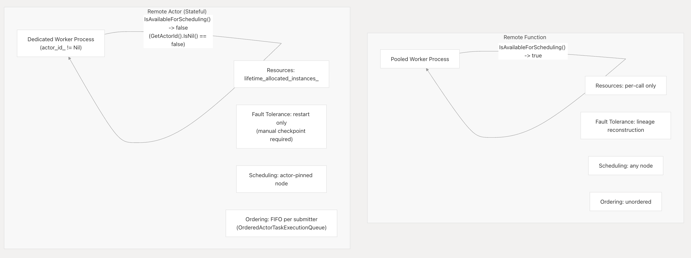

# Why the Task / Actor Split Is Fundamental

Ray separates Remote Functions (tasks) and Remote Actors because they solve two conflicting execution requirements: stateless scaling vs. stateful localization. This systemic dichotomy is formally introduced in the [Ray architecture paper (OSDI '18)](../References/osdi18-moritz.pdf).

If Ray allowed ordinary functions to maintain mutable state, retry-on-failure would become state reconstruction—requiring checkpointing and rollback at the task execution layer. Ray enforces unconditionally stateless tasks to enable zero-overhead re-execution, drawing directly from the fault-tolerance designs of [MapReduce](../References/mapreduce.pdf) and [Spark (NSDI '12)](../References/nsdi12-final138.pdf), where lost work is seamlessly recomputed from deterministic lineage rather than recovered from preserved state.

For workloads genuinely requiring process-local state (e.g., parameter servers or simulators), Ray encapsulates mutability within long-lived, dedicated worker processes, safely deferring to established Actor model semantics (Hewitt, Agha) to guarantee localized state isolation.

**Core Invariant:** Every task must be safely re-executable from any compatible worker, with zero dependency on prior execution history. If this breaks, the fault tolerance model collapses.

## 1. Worker Process Model: Pooled vs. Dedicated

Tasks and actors use fundamentally different worker process lifecycles.

**Stateless tasks use reusable, pooled workers.** The Raylet's `FindAndPopIdleWorker()` reuses an idle process for any compatible task to sustain high throughput. The `max_calls` parameter controls when a task worker must forcibly exit (e.g., after 1 GPU task) to trigger resource cleanup between tasks (`remote_function.py:218-225`).

**Actor workers are permanently dedicated.** Once bound, an actor worker is excluded from the reusable pool via a hard logical check in `IsAvailableForScheduling()` (`worker.h:151-158`). The core invariant sits directly in the C++ layer: the `actor_id_` field dictates worker identity ("If this is nil, then we execute only stateless tasks" `core_worker.h:1034-1037`). A worker's type is locked irreversibly at lease-grant time; an actor lease permanently precludes normal task leases (`worker.h:229-232`).

## 2. Resource Reservation: Per-Call vs. Lifetime

Tasks hold resources only while executing. Actors reserve them for their entire lifecycle.

Ray implements this separation explicitly on the worker via two resource fields: `allocated_instances` (transient, flushed per task) and `lifetime_allocated_instances` (held completely for the actor's existence) (`worker.h:104-131`). The Raylet's lease-grant path routes resources into the correct field specifically by checking if the task spec is an actor creation task (`worker.h:135-145`).

This surfaces in `TaskSpecification`, which bifurcates requests into `GetRequiredResources()` for execution and `GetRequiredPlacementResources()` for lifetime actor scheduling (`task_spec.h:247-256`). Collapsing these models would blind the scheduler to allocation lifetime.

## 3. Fault Tolerance: Lineage Reconstruction vs. Process Checkpointing

Because tasks are unconditionally stateless, a lost output object triggers automatic lineage reconstruction. The `TaskManager` and `ObjectRecoveryManager` simply re-execute the pinned task spec because the function is idempotent by design (`task_manager.h:175-230`), and `max_retries` acts as a pure attempt budget (`remote_function.py:228-232`).

Actors cannot leverage this execution lineage because their state is the accumulated result of sequentially executed prior mutative method calls. When an actor crashes, Ray only restarts it by re-running `__init__`, completely erasing all intermediate state mutations (`actor.py:413-425`). `max_restarts` supplies process-level continuity, not durable state fault tolerance.

## 4. Free Node Scheduling vs. Strict Dispatch Binding

Tasks are independent. The scheduler routes them to any available node satisfying their resource demands, achieving massive global parallelism.

Actors must route all method calls to exactly the same dedicated worker process to persist state. `SubmitTask()` and `SubmitActorTask()` are wholly separate operations in `CoreWorker` (`core_worker.h:857-867`, `core_worker.h:932-961`). While `SubmitTask()` freely selects any backend, `SubmitActorTask()` formally mandates an `ActorID` to bind the payload to a recognized worker.

If stateless functions were secretly permitted to mutate state, Ray would have to solve this actor-pinning problem per execution, destroying task routing flexibility.

## 5. Execution Ordering: Unordered vs. Sequenced

The scheduler deliberately executes tasks out-of-order to maximize backend throughput. Conversely, an actor's state integrity depends on serialized execution.

Ray strictly enforces FIFO execution ordering for actor methods from identical submitters through a dedicated `OrderedActorTaskExecutionQueue`, driven by a monotonically ascending `sequence_number` embedded on every `PushTaskRequest` (`task_spec.h:308-323`, `ordered_actor_task_execution_queue.h:1-40`).

Enabling this rigorous ordering infrastructure on inherently stateless tasks would cripple scalable parallelism.

## Summary

The `TaskSpecification` payload fundamentally leverages three boolean discriminators—`IsNormalTask()`, `IsActorCreationTask()`, `IsActorTask()`—to aggressively fork the execution pipeline throughout the entire runtime (`task_spec.h:284-291`). Allowing task state destroys the safety and scalability of the `IsNormalTask()` branch.
