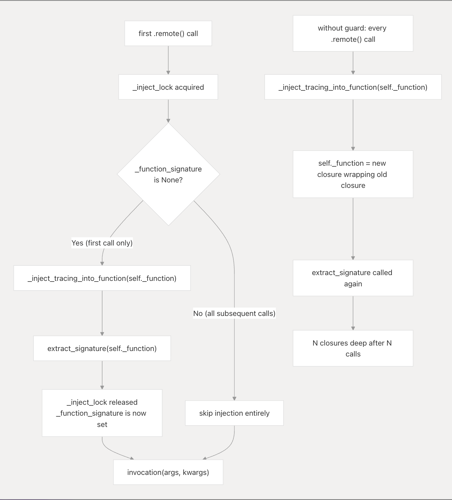

# Why Ray Injects Tracing Exactly Once in `RemoteFunction`

Ray treats tracing injection as a lazy, one-time initialization step. Re-injecting decorators on every `.remote()` call would turn a cheap dispatch path into a repeatedly mutating, thread-sensitive wrapper stack with severe memory, correctness, and performance penalties.

The guard in `RemoteFunction._remote()` freezes the dispatch object after its first use (`remote_function.py:341-346`):
```python
with self._inject_lock:
    if self._function_signature is None:
        self._function = _inject_tracing_into_function(self._function)
        self._function_signature = ray._common.signature.extract_signature(self._function)
```

**Core Invariant:** The `RemoteFunction` object must act as an immutable, read-mostly dispatch handle after its first invocation.

## 1. What Breaks Without One-Time Injection

If the lock and sentinel were removed, re-injection would trigger four systemic failures:

**Unbounded Closure Chain (Memory Leak):** 
`_inject_tracing_into_function()` wraps `self._function` and replaces it (`tracing_helper.py:326-363`). Calling this on every `.remote()` invocation would bury the function $N$ closures deep, perpetually leaking memory. While `_add_param_to_signature` contains an idempotency guard (`tracing_helper.py:115-124`), it does not protect the function itself from being recursively re-wrapped.

**Race Conditions in Multi-Threaded Drivers:** 
The `_inject_lock` established in `__init__` (`remote_function.py:152-153`) prevents concurrent dispatch threads from experiencing a TOCTOU (time-of-check/time-of-use) race. Without the lock, as outlined by fundamental [Python `threading` concurrency paradigms](https://docs.python.org/3/library/threading.html), threads would simultaneously execute injection, racing to overwrite `self._function` and `self._function_signature`, leaving the object in a misaligned state.

**Stale Pickled Functions on Workers:** 
After injection, the function is pickled for export to workers (`remote_function.py:366-372`). If the driver locally re-wrapped the function on subsequent calls, the active local closure payload would rapidly diverge from the previously exported, shallower version running on workers. 

**Hot-Path Overhead:** 
`extract_signature()` relies on the computationally expensive `inspect.signature` package (`signature.py:58-79`). The extracted signature is required by `flatten_args()` during every task submission (`remote_function.py:480-485`). Re-extracting this per-call instead of caching it would crush task submission throughput.

## 2. Lock and Sentinel: The Safest Tradeoff

The lock-and-sentinel construct delays tracing overhead until the last possible moment. Because tracing fundamentally depends on the Ray runtime, it cannot be executed eagerly at `@ray.remote` decoration time (where `ray.init()` is not guaranteed to exist) (`remote_function.py:339-340`). 

When state is transmitted, the `__getstate__` design drops the unpicklable Lock but preserves the `_function_signature` so deserialized objects safely skip the injection block immediately (`remote_function.py:180-188`).

## 3. Failure Semantics & Abstraction Leaks

**Injection Failure Recovery:** 
If injection raises an exception, `_function_signature` safely remains `None`. Subsequent calls will effortlessly re-attempt initialization without retaining a corrupted state.

**Invisible Mutation:** 
The abstraction leaks on first use. `RemoteFunction` appears immutable post-decoration but silently mutates itself on the first `.remote()`. Debugging or introspecting `self._function` across this boundary reveals totally different underlying callable objects.

## Summary



First-call injection isolates initialization from recurring execution. By guarding the setup with a lock and sentinel, Ray pays the reflection and wrapping costs identically once, guaranteeing the `RemoteFunction` persists as a completely stable dispatch handle.
