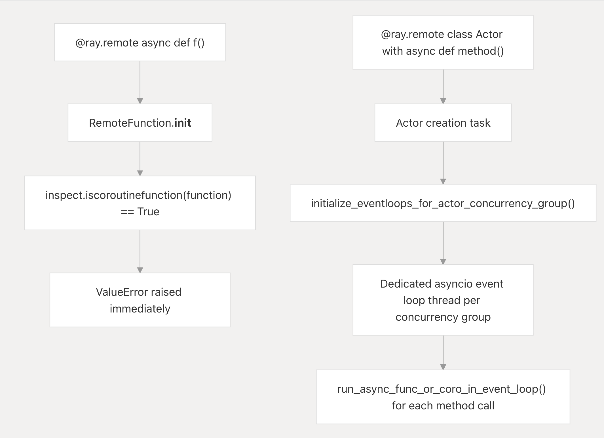

# Why Ray Rejects `async def` Remote Functions

Ray draws a hard line protecting the simple synchronicity of stateless remote tasks from the sprawling complexities of asynchronous execution. As established in [PEP 492](https://peps.python.org/pep-0492/), Python `async`/`await` primitives intrinsically require an event loop to orchestrate coroutine suspension. A standard Ray task intrinsically lacks an `asyncio` event loop; injecting a coroutine would silently return an unresolved object instead of processing application logic.

**Core Invariant:** A remote task always resolves a concrete return payload. Emitting unawaited coroutine objects constitutes an invisible semantic failure, so Ray explicitly blocks the execution path at definition time.

## 1. Remote Tasks Possess No Event Loop

When wrapping a typical implementation with `@ray.remote`, `RemoteFunction.__init__` heavily intercepts the assignment using `inspect.iscoroutinefunction()`, immediately failing with a `ValueError` rather than awaiting deployment (`remote_function.py:98-103`). This proactive safeguard is rigorously tested (`test_asyncio.py:333-338`). 

The standard stateless `execute_task` model processes execution sequentially in pure C++. `TASK_TYPE_NORMAL_TASK` payloads dynamically assign the `function_executor` directly to `execution_info.function`, devoid of any underlying event loop management layer (`_raylet.pyx:1746-1755`), before blindly acquiring and storing the direct return sequence (`_raylet.pyx:1848-1855`). 

If an `async def` circumvented the decorator restrictions, the runtime routine would immediately capture and serialize the unawaited coroutine descriptor into the Object Store, concluding the task seemingly successfully whilst silently abandoning the core algorithmic payload.

## 2. Async Lifecycle Uniquely Mandates Actors

Event loops require stable persistence, cancellation semantics, and dedicated lifecycles wholly inappropriate for purely disposable task pools. 

When deploying asynchronous applications, Ray demands stateful Async Actors. Upon detecting asynchronous inner signatures during initialization, Ray explicitly binds persistent event loops mapped per isolated concurrency group (`_raylet.pyx:2132-2135`).

In this controlled execution lane, `function_executor` conditionally routes `current_actor_is_asyncio()` payloads onto the dedicated thread by bridging into `run_async_func_or_coro_in_event_loop` (`_raylet.pyx:1762-1798`). Ray pauses the C++ caller leveraging `YieldCurrentFiber` while the background framework processes the execution yield. This allows long-lived stateful processes to naturally multiplex multiplex without polluting the overarching runtime loop.

## 3. Circumvention & Tradeoffs 

**The Supported Workaround:**
As explicitly documented within `async_api.rst:313-334`, users aggressively requiring asynchronous interactions strictly inside a standard stateless task must explicitly package the logic into independent `asyncio.run(f())` wrappers. This natively controls and tears down the single-use event loop securely inside a strictly synchronous external boundary.

**Concurrency Bottlenecks:**
An async actor scales multiplexed task assignments heavily relying upon `max_concurrency` restrictions without genuine parallelism. Should all queued tasks pivot into completely CPU-bound constraints without successfully `await`-ing, the loop starves, silently burying queued operations from the core scheduler's perspective. 

## Summary

| Aspect                     | Normal Remote Task                                  | Async Actor Method                                      |
|----------------------------|-----------------------------------------------------|---------------------------------------------------------|
| **Worker Lifecycle**       | Stateless, short-lived                              | Long-lived, stateful                                    |
| **Event Loop**             | ❌ None                                              | ✅ Persistent per concurrency group                      |
| **async def Support**      | ❌ Blocked at decoration time                        | ✅ Fully supported                                       |
| **Coroutine Execution**    | Would silently return unawaited coroutine           | Dispatched via `asyncio.run_coroutine_threadsafe`        |

Ray rejects `async def` tasks to forcefully protect stateless predictability. Rapid failure at the decorator unequivocally safeguards systemic execution mechanics securely across massive boundaries.
