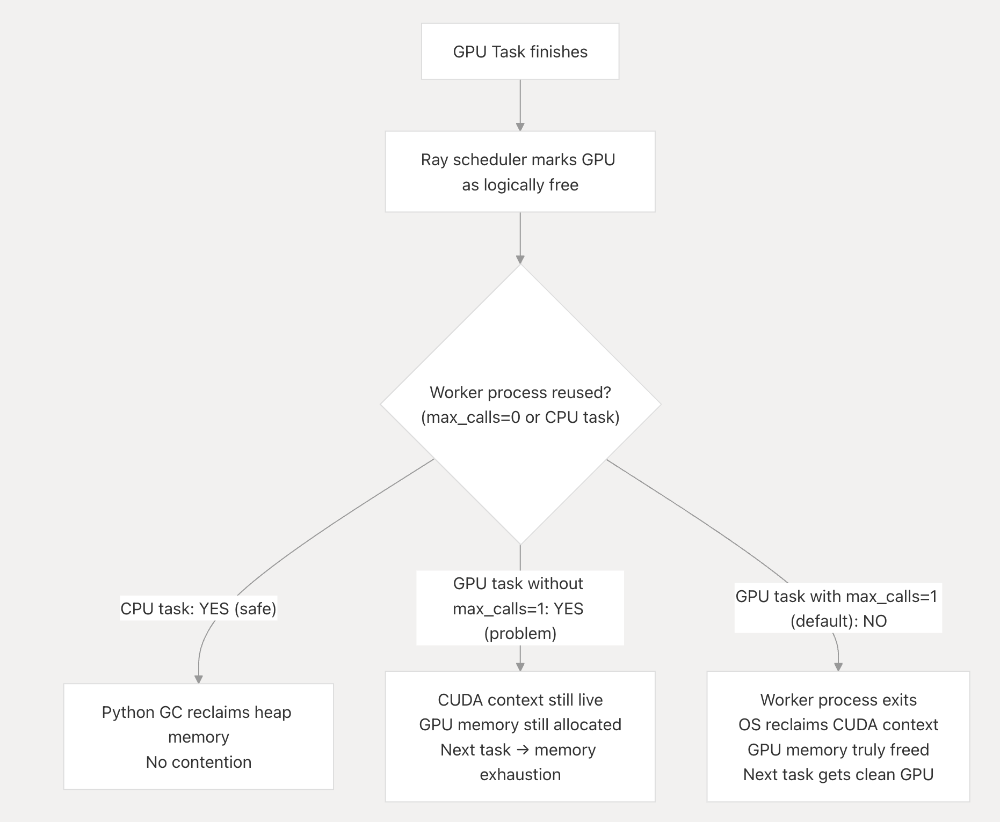

# Why Ray Uses `max_calls=1` for GPU Tasks by Default

Ray treats GPU task scheduling distinctly from CPU tasks because opaque third-party VRAM allocations aggressively bypass traditional Python interpreter garbage cycles, routinely surviving nominal task completions indefinitely. 

**Core Invariant:** The scheduler's logical perspective of GPU availability must rigorously reflect genuine physical VRAM capacity. Ignoring VRAM pollution routinely cascades into abrupt out-of-memory errors on sequentially allocated workflows.

## 1. Process Death is the Only Ironclad Hardware Scrubber

As clearly outlined inside the accelerator documentation, Ray cannot mandate hardware cleanup directly:  
*"Currently, when a worker executes a task that uses a GPU (e.g., through TensorFlow), the task may allocate memory on the GPU and may not release it when the task finishes executing."* (`accelerators.rst:718-724`). This correctly defers to frameworks like PyTorch, whose [CUDA caching allocator](https://pytorch.org/docs/stable/notes/cuda.html) aggressively pools memory and frequently refuses to formally release VRAM blocks to the host OS until full process termination.

If a worker safely transitions back onto the idle pool (`max_calls=0`), the scheduler falsely broadcasts to the cluster that its designated logical GPU slots are physically empty. A subsequent execution targeting the GPU crashes immediately in OOM due to persistent CUDA tracking caching left dormant by its predecessor. The official docstring identically echoes this constraint (`worker.py:3715-3722`).

To counteract this, Ray intercepts task compilation checking for `num_gpus > 0` and forcefully implants `max_calls = 1` as the unwavering default (`remote_function.py:106-120`). Upon incrementing to this limit internally, `_raylet.pyx:2219-2228` ruthlessly forces the worker process offline. Eradicating the overarching OS process physically annihilates the CUDA context entirely, aggressively flushing allocations securely before a secondary task initializes. This is rigorously proven inside `test_max_calls_releases_resources` (`test_basic.py:159-172`), which hangs violently without it.

*(Standard CPU tasks manage heap memory cleanly via standard Python garbage collection cycles. Their allocations flush accurately allowing transparent and safe cross-task reuse.)*

## 2. Scale Penalties & Tactical Escape Hatches

This heavy-handed destruction heavily enforces total hardware correctness, albeit via extreme latency consequences: 

**Throughput Sabotage:** 
Launching 1,000 transient models mandates spawning exactly 1,000 distinct OS processes combined with repeating dense Python plus CUDA initialization routines repeatedly consuming hundreds of milliseconds directly. There is fundamentally zero warm pooling. 

**Cache Destruction:**
Model compiling optimizations seamlessly vanish per invocation. Users retaining deep knowledge regarding precise deep-learning framework cleanups (e.g. implementing verified `torch.cuda.empty_cache()` strategies) can manually opt-out, overriding with `max_calls=0` for advanced pipelining strategies (`accelerators.rst:722-736`).

**(Note: Ray enforces identical execution-destruction cycles forcibly evaluating instances bearing active `nsight` or `rocprof-sys` environments—given the underlying profile sequences exclusively compile their trace logs immediately upon core process cessation (`remote_function.py:107-120`)).**

## 3. Abstraction Leaks 

**Scheduler Desyncs:** 
Following worker cessation, a physical synchronization gap emerges where a GPU lacks operational execution capability despite the host scheduler flagging it available. Intense concurrent scaling frequently queues executions unproductively during this CUDA setup blind spot. 

**Overcommitment Chaos:** 
The scheduling token merely enforces cluster node placements; deploying `num_gpus=1` does not mechanically partition remaining VRAM constraints. Overloading device execution thresholds heavily remains purely an operational concern left to the specific developer. 

## Summary

Enduring violent process regeneration guarantees absolutely transparent functionality across massively pooled hardware segments. Forcing context destruction operates substantially cheaper at massive organizational levels than continually fighting catastrophic execution leakages.
