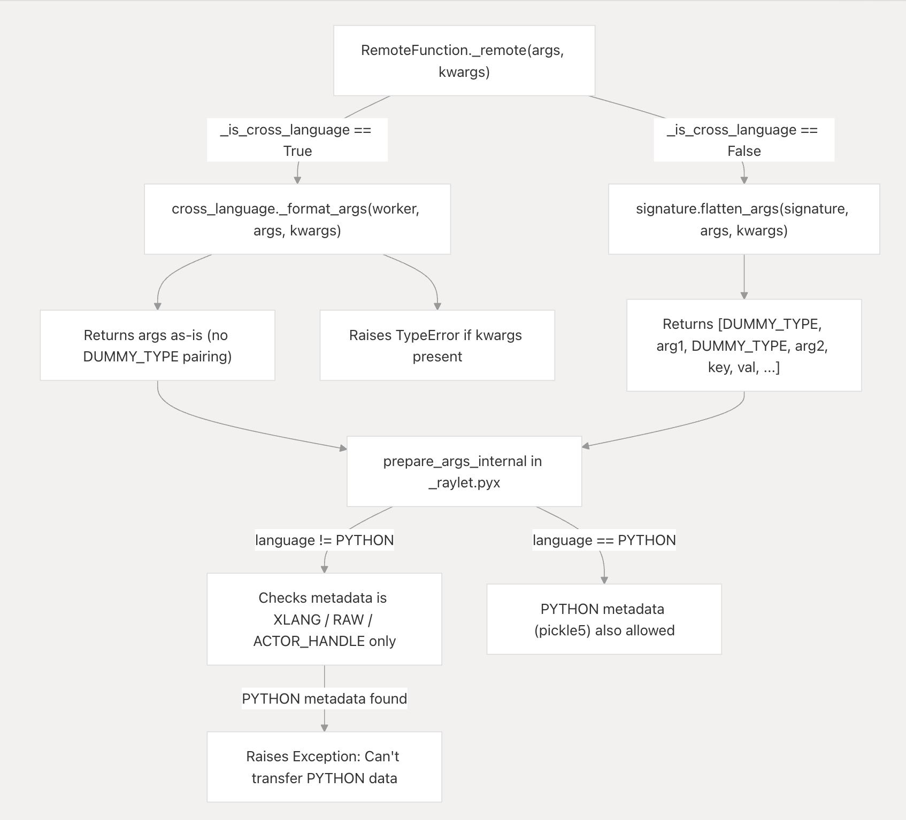

# Why Ray Uses Different Argument Formatting for Cross-Language Functions

Ray maintains completely separate argument formatting logic for Python-to-Python execution and cross-language execution. A unified format would either force non-Python runtimes to parse Python-specific serialization logic or strip Python of its native calling capabilities (like kwargs and custom objects). 

**Core Invariant:** Function arguments delivered to a non-Python worker must be robustly decodable by that worker’s native runtime using language-neutral serialization formats like [MessagePack](https://msgpack.org/index.html), completely devoid of Python-specific compatibility shims.

## 1. The Python Formatting Path

For Python-to-Python remote executions, `RemoteFunction._remote` heavily relies on `flatten_args(...)` to inject arbitrary parameters cleanly. This routine produces a flattened serialization list strictly pairing parameters behind arbitrary `b"__RAY_DUMMY__"` sentinel encodings (`signature.py:104-137`). This structurally enables receiving Python counterparts to explicitly isolate keyword values correctly upon receipt utilizing `recover_args` natively (`signature.py:140-163`).

These proprietary headers exist safely within homogeneous environments; however, Java and C++ frameworks completely crash evaluating rogue `DUMMY_TYPE` prefixes natively. Validating this boundary from the opposite direction, passing calls upstream from Java intentionally mirrors this explicitly by artificially prefixing parameters forcefully with a custom Java `PYTHON_DUMMY_TYPE` to guarantee the underlying Python execution interprets it exactly as anticipated (`ArgumentsBuilder.java:22-70`).

## 2. The Cross-Language Formatting Path

When traversing across languages (`language != Language.PYTHON` initialized via `remote_function.py:148-156`), Ray explicitly abandons `flatten_args`. Instead, the pipeline invokes the alternative `cross_language._format_args(...)` mapping (`remote_function.py:477-485`).

This discrete isolation block guarantees the resultant payloads remain purely positional and native to the corresponding language target—entirely ignoring proprietary Python signatures (`cross_language.py:83-103`). 

Simultaneously, `_format_args` violently rejects keyword configurations natively natively, explicitly throwing a `TypeError` if present (`cross_language.py:98-102`). Java and C++ fundamentally discard kwargs architectures entirely within their execution bounds; introducing synthetic support merely creates false interface contracts directly violating basic target invocation principles. 

## 3. Strictly Regulating Serialization Metadata 

Following argument formatting, core execution loops filter target assignments securely utilizing `prepare_args_internal` (inside `_raylet.pyx`). When navigating non-Python deployments, the serializer rigidly demands every parameter matches acceptable msgpack/raw bytecode parameters (`XLANG`, `RAW`, or `ACTOR_HANDLE`), actively rejecting anything else (`_raylet.pyx:844-851`). Java instances similarly align against this precise metadata dictionary natively (`ObjectSerializer.java:66-73`, `ArgumentsBuilder.java:38-53`). The complete dictionary of available payload identifiers resides inside `ray_constants.py:344-356`.

Python uniquely tolerates unsupported types utilizing the explicit fallback `PYTHON` (`pickle5`) format identifier (`serialization.py:655-677`). Non-Python structures hopelessly fail decrypting pickeled payload byte sequences, subsequently rendering unsupported objects actively hostile constraints (`test_cross_language_invocation.py:42-47`). 

## Summary

Rather than engineering a fragile lowest-common-denominator "universal" format, Ray deliberately forks its execution mapping. Creating the target wrapper safely utilizes an explicit `lambda *args, **kwargs: None` stub template entirely precluding standard python inspection architectures natively (`cross_language.py:14-46`), cleanly proving cross-language functions permanently bypass Python's homogeneous capabilities immediately at initialization.
